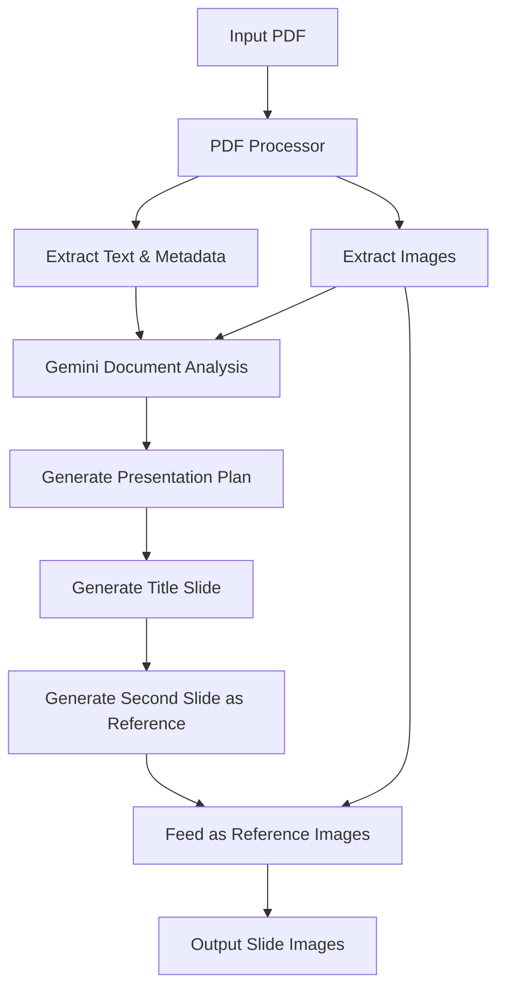

Based on my analysis of your repository and the Gemini API documentation, I'll create a comprehensive implementation plan for your PDF-to-slide presentation system.

## Overview

Your existing `everyday_my_arxiv` repository demonstrates excellent modular architecture with separate concerns for LLM interaction, prompts management, and output generation. The new system will leverage Gemini's document understanding capabilities [1], image generation with reference images for style consistency [2] [3], and PDF image extraction using PyMuPDF [4].

## System Architecture

### High-Level Workflow



### Directory Structure

```
paper_to_slides/
├── config/
│   ├── config.json                    # General configuration
│   └── image_generation_config.json   # Image gen parameters
│
├── src/
│   ├── pdf/
│   │   ├── __init__.py
│   │   ├── reader.py                  # PDF text extraction
│   │   ├── image_extractor.py         # Extract images from PDF
│   │   └── metadata_parser.py         # Parse PDF metadata
│   │
│   ├── llm/
│   │   ├── __init__.py
│   │   ├── gemini_client.py           # Gemini API wrapper
│   │   ├── document_analyzer.py       # PDF analysis with Gemini
│   │   ├── image_generator.py         # Image generation orchestrator
│   │   └── prompts/
│   │       ├── paper_analysis.txt     # Analyze entire paper
│   │       ├── presentation_plan.txt  # Create slide plan
│   │       ├── title_slide.txt        # Generate title slide
│   │       ├── content_slide.txt      # Generate content slides
│   │       └── image_description.txt  # Describe extracted images
│   │
│   ├── presentation/
│   │   ├── __init__.py
│   │   ├── planner.py                 # Plan presentation structure
│   │   ├── slide_generator.py         # Coordinate slide generation
│   │   └── style_manager.py           # Manage visual consistency
│   │
│   ├── output/
│   │   ├── __init__.py
│   │   ├── image_saver.py             # Save generated images
│   │   └── metadata_writer.py         # Save slide metadata/notes
│   │
│   └── utils/
│       ├── __init__.py
│       ├── image_processor.py         # Image preprocessing
│       ├── cache_manager.py           # Cache intermediate results
│       └── logger.py                  # Logging utilities
│
├── scripts/
│   ├── generate_slides.py             # Main entry point
│   ├── test_local.py                  # Local testing
│   └── batch_process.py               # Process multiple PDFs
│
├── tests/
│   ├── test_pdf_processing.py
│   ├── test_llm_integration.py
│   └── test_slide_generation.py
│
├── docs/
│   └── examples/                      # Example outputs
│
├── .github/
│   └── workflows/
│       └── test.yml                   # CI/CD pipeline
│
├── pyproject.toml
├── requirements.txt
├── README.md
└── .env.example
```

## Implementation Plan

### Phase 1: PDF Processing Module

**File: `src/pdf/reader.py`**
- Use PyMuPDF (fitz) for PDF text extraction [4]
- Extract document structure (sections, paragraphs)
- Parse metadata (title, authors, abstract)

**File: `src/pdf/image_extractor.py`**
- Extract all images from PDF using PyMuPDF's image extraction API [4]
- Save images with metadata (page number, position, size)
- Filter low-quality or decorative images
- Convert images to formats compatible with Gemini API

**Key Functions:**
```python
class PDFReader:
    def extract_text(self, pdf_path: str) -> Dict[str, Any]
    def extract_metadata(self, pdf_path: str) -> Dict[str, str]
    def get_page_count(self, pdf_path: str) -> int

class ImageExtractor:
    def extract_images(self, pdf_path: str) -> List[ExtractedImage]
    def filter_images(self, images: List[ExtractedImage]) -> List[ExtractedImage]
    def save_images(self, images: List[ExtractedImage], output_dir: str)
```

### Phase 2: LLM Integration Module

**File: `src/llm/gemini_client.py`**
- Wrapper around Google Gemini API
- Handle rate limiting and retries
- Support both text and multimodal requests
- Similar structure to your existing `src/llm/gemini.py`

**File: `src/llm/document_analyzer.py`**
- Upload PDF to Gemini for document understanding [1] [2]
- Generate comprehensive paper summary
- Extract key contributions, methodology, results
- Identify important figures and their relevance

**File: `src/llm/image_generator.py`**
- Implement reference image workflow for style consistency [2] [3]
- Generate title slide (becomes reference image 1)
- Generate second slide (becomes reference image 2)
- Generate subsequent slides using both references
- Integrate extracted PDF images as additional context

**Key Functions:**
```python
class GeminiClient:
    def analyze_document(self, pdf_path: str, prompt: str) -> str
    def generate_image(self, prompt: str, reference_images: List[str] = None) -> bytes
    def describe_image(self, image_path: str) -> str

class DocumentAnalyzer:
    def analyze_paper(self, pdf_path: str) -> PaperAnalysis
    def extract_key_points(self, analysis: PaperAnalysis) -> List[KeyPoint]
    def identify_important_figures(self, pdf_images: List[ExtractedImage]) -> List[ImportantFigure]

class ImageGenerator:
    def generate_title_slide(self, paper_info: Dict) -> GeneratedSlide
    def generate_reference_slide(self, content: str, title_slide: GeneratedSlide) -> GeneratedSlide
    def generate_content_slide(self, content: str, references: List[GeneratedSlide], pdf_images: List[str]) -> GeneratedSlide
```

### Phase 3: Presentation Planning Module

**File: `src/presentation/planner.py`**
- Create presentation structure based on paper analysis
- Determine number of slides and content distribution
- Plan visual elements for each slide
- Similar to your existing ranking/filtering logic

**File: `src/presentation/slide_generator.py`**
- Orchestrate the entire slide generation workflow
- Manage reference image propagation
- Handle dependencies between slides

**File: `src/presentation/style_manager.py`**
- Define and maintain visual style guidelines
- Ensure consistency across slides
- Manage color schemes, fonts, layouts

**Key Functions:**
```python
class PresentationPlanner:
    def create_plan(self, paper_analysis: PaperAnalysis) -> PresentationPlan
    def allocate_content_to_slides(self, key_points: List[KeyPoint]) -> List[SlideContent]
    def plan_visual_elements(self, slide_content: SlideContent, pdf_images: List[ExtractedImage]) -> VisualPlan

class SlideGenerator:
    def generate_presentation(self, pdf_path: str) -> List[GeneratedSlide]
    def generate_slide_sequence(self, plan: PresentationPlan) -> List[GeneratedSlide]

class StyleManager:
    def get_style_prompt(self) -> str
    def validate_style_consistency(self, slides: List[GeneratedSlide]) -> bool
```

### Phase 4: Prompt Management

Following your existing pattern in `src/llm/prompts/`, create modular prompt templates:

**`prompts/paper_analysis.txt`**
```
Analyze this academic paper comprehensively. Focus on:
1. Main research question and motivation
2. Key methodology and approach
3. Main results and contributions
4. Important figures and their significance
5. Potential visual representations for a presentation

Provide a structured analysis suitable for creating a presentation.
```

**`prompts/presentation_plan.txt`**
```
Based on the paper analysis, create a presentation plan with:
1. Recommended number of slides (typically 8-12)
2. Content allocation for each slide
3. Visual style recommendations
4. Key messages for each slide

Paper Analysis:
{analysis}
```

**`prompts/title_slide.txt`**
```
Generate a visually appealing title slide for an academic presentation.

Title: {title}
Authors: {authors}
Key Theme: {theme}

Style: Modern, professional, academic
Include: Title, authors, key visual metaphor for the research
```

**`prompts/content_slide.txt`**
```
Generate a presentation slide image with the following content:

Slide Title: {title}
Main Points: {points}
Visual Theme: {theme}

Reference Images: Maintain visual consistency with the provided reference slides.
Extracted Figures: {figure_descriptions}

Style: Clean, professional, suitable for academic presentation
```

### Phase 5: Configuration Management

**`config/config.json`**
```json
{
  "gemini": {
    "model": "gemini-2.0-flash-exp",
    "image_model": "gemini-2.5-flash",
    "temperature": 0.7,
    "max_retries": 3
  },
  "pdf": {
    "max_pages": 50,
    "image_quality_threshold": 0.5,
    "min_image_size": [100, 100]
  },
  "presentation": {
    "default_slide_count": 10,
    "max_slides": 15,
    "min_slides": 5,
    "image_format": "png",
    "image_size": [1920, 1080]
  },
  "cache": {
    "enabled": true,
    "ttl_hours": 24
  }
}
```

**`config/image_generation_config.json`**
```json
{
  "style_guidelines": {
    "color_scheme": "professional",
    "layout": "modern",
    "font_style": "clean sans-serif"
  },
  "reference_images": {
    "use_title_as_reference": true,
    "use_second_as_reference": true,
    "max_reference_images": 2
  },
  "generation_params": {
    "aspect_ratio": "16:9",
    "quality": "high",
    "safety_settings": "default"
  }
}
```

## Detailed Workflow Implementation

### Main Script: `scripts/generate_slides.py`

```python
#!/usr/bin/env python3
"""
Main script for generating presentation slides from academic papers.

Usage:
    python scripts/generate_slides.py --pdf path/to/paper.pdf --output output_dir/
"""

import argparse
import logging
from pathlib import Path
from typing import Optional

from src.pdf.reader import PDFReader
from src.pdf.image_extractor import ImageExtractor
from src.llm.document_analyzer import DocumentAnalyzer
from src.llm.image_generator import ImageGenerator
from src.presentation.planner import PresentationPlanner
from src.presentation.slide_generator import SlideGenerator
from src.output.image_saver import ImageSaver
from src.utils.logger import setup_logger
from src.utils.cache_manager import CacheManager


def main(pdf_path: str, output_dir: str, use_cache: bool = True):
    """
    Main workflow for generating presentation slides.
    
    Args:
        pdf_path: Path to input PDF file
        output_dir: Directory for output slides
        use_cache: Whether to use cached intermediate results
    """
    logger = setup_logger(__name__)
    logger.info(f"Starting slide generation for {pdf_path}")
    
    # Initialize components
    pdf_reader = PDFReader()
    image_extractor = ImageExtractor()
    doc_analyzer = DocumentAnalyzer()
    presentation_planner = PresentationPlanner()
    slide_generator = SlideGenerator()
    image_saver = ImageSaver(output_dir)
    cache = CacheManager() if use_cache else None
    
    # Step 1: Extract PDF content
    logger.info("Step 1: Extracting PDF content...")
    pdf_text = pdf_reader.extract_text(pdf_path)
    pdf_metadata = pdf_reader.extract_metadata(pdf_path)
    pdf_images = image_extractor.extract_images(pdf_path)
    
    # Step 2: Analyze paper with Gemini
    logger.info("Step 2: Analyzing paper with Gemini...")
    cache_key = f"analysis_{Path(pdf_path).stem}"
    
    if cache and cache.exists(cache_key):
        paper_analysis = cache.get(cache_key)
    else:
        paper_analysis = doc_analyzer.analyze_paper(pdf_path)
        if cache:
            cache.set(cache_key, paper_analysis)
    
    # Step 3: Create presentation plan
    logger.info("Step 3: Creating presentation plan...")
    presentation_plan = presentation_planner.create_plan(
        paper_analysis, pdf_metadata, pdf_images
    )
    
    # Step 4: Generate slides
    logger.info("Step 4: Generating slides...")
    slides = slide_generator.generate_slide_sequence(
        presentation_plan, pdf_images
    )
    
    # Step 5: Save outputs
    logger.info("Step 5: Saving outputs...")
    image_saver.save_slides(slides)
    image_saver.save_metadata(presentation_plan, slides)
    
    logger.info(f"Successfully generated {len(slides)} slides in {output_dir}")


if __name__ == "__main__":
    parser = argparse.ArgumentParser(
        description="Generate presentation slides from academic papers"
    )
    parser.add_argument(
        "--pdf", required=True, help="Path to input PDF file"
    )
    parser.add_argument(
        "--output", required=True, help="Output directory for slides"
    )
    parser.add_argument(
        "--no-cache", action="store_true", help="Disable caching"
    )
    
    args = parser.parse_args()
    main(args.pdf, args.output, use_cache=not args.no_cache)
```

## Key Technical Considerations

### 1. Reference Image Management [2] [3]

The Gemini API supports reference images for style consistency. Implementation strategy:

```python
class ImageGenerator:
    def __init__(self):
        self.reference_slides = []
    
    def generate_title_slide(self, paper_info: Dict) -> GeneratedSlide:
        """Generate title slide - becomes first reference"""
        prompt = self._build_title_prompt(paper_info)
        image_bytes = self.gemini_client.generate_image(prompt)
        
        slide = GeneratedSlide(
            index=0,
            type="title",
            image=image_bytes,
            prompt=prompt
        )
        self.reference_slides.append(slide)
        return slide
    
    def generate_content_slide(
        self, 
        content: SlideContent, 
        pdf_images: List[str]
    ) -> GeneratedSlide:
        """Generate content slide using reference images"""
        prompt = self._build_content_prompt(content, pdf_images)
        
        # Use first two slides as references for consistency
        reference_images = [
            slide.image for slide in self.reference_slides[:2]
        ]
        
        image_bytes = self.gemini_client.generate_image(
            prompt, 
            reference_images=reference_images
        )
        
        return GeneratedSlide(
            index=content.index,
            type="content",
            image=image_bytes,
            prompt=prompt
        )
```

### 2. PDF Document Analysis [1] [2]

Gemini supports native PDF processing:

```python
class DocumentAnalyzer:
    def analyze_paper(self, pdf_path: str) -> PaperAnalysis:
        """Analyze entire PDF with Gemini's document understanding"""
        with open(pdf_path, 'rb') as f:
            pdf_data = f.read()
        
        # Upload PDF to Gemini
        prompt = self.prompt_manager.get_prompt('paper_analysis')
        
        response = self.gemini_client.analyze_document(
            pdf_data=pdf_data,
            prompt=prompt,
            mime_type='application/pdf'
        )
        
        return self._parse_analysis(response)
```

### 3. Image Extraction from PDF [4]

```python
import fitz  # PyMuPDF

class ImageExtractor:
    def extract_images(self, pdf_path: str) -> List[ExtractedImage]:
        """Extract all images from PDF using PyMuPDF"""
        doc = fitz.open(pdf_path)
        extracted_images = []
        
        for page_num in range(len(doc)):
            page = doc[page_num]
            image_list = page.get_images(full=True)
            
            for img_index, img in enumerate(image_list):
                xref = img[0]
                base_image = doc.extract_image(xref)
                
                image_data = base_image["image"]
                image_ext = base_image["ext"]
                
                extracted_images.append(ExtractedImage(
                    page_num=page_num,
                    index=img_index,
                    data=image_data,
                    format=image_ext,
                    width=base_image.get("width"),
                    height=base_image.get("height")
                ))
        
        return self.filter_images(extracted_images)
```

### 4. Prompt Management Pattern

Following your existing architecture:

```python
class PromptManager:
    """Manage prompt templates similar to everyday_arxiv"""
    
    def __init__(self, prompts_dir: str = "src/llm/prompts"):
        self.prompts_dir = Path(prompts_dir)
        self._cache = {}
    
    def get_prompt(self, prompt_name: str) -> str:
        """Load prompt template from file"""
        if prompt_name in self._cache:
            return self._cache[prompt_name]
        
        prompt_path = self.prompts_dir / f"{prompt_name}.txt"
        with open(prompt_path, 'r') as f:
            prompt = f.read()
        
        self._cache[prompt_name] = prompt
        return prompt
    
    def format_prompt(self, prompt_name: str, **kwargs) -> str:
        """Format prompt template with variables"""
        template = self.get_prompt(prompt_name)
        return template.format(**kwargs)
```

## Dependencies (`requirements.txt`)

```txt
# Core dependencies
google-generativeai>=0.8.0
PyMuPDF>=1.24.0
Pillow>=10.0.0

# Utilities
python-dotenv>=1.0.0
pydantic>=2.0.0
tenacity>=8.2.0

# Logging and monitoring
loguru>=0.7.0

# Testing
pytest>=7.4.0
pytest-asyncio>=0.21.0
pytest-cov>=4.1.0

# Development
black>=23.0.0
ruff>=0.1.0
mypy>=1.5.0
```

## Next Steps

1. **Phase 1 (Week 1)**: Implement PDF processing module with text and image extraction
2. **Phase 2 (Week 2)**: Implement Gemini client and document analysis
3. **Phase 3 (Week 3)**: Implement presentation planning and slide generation logic
4. **Phase 4 (Week 4)**: Implement image generation with reference image workflow
5. **Phase 5 (Week 5)**: Testing, refinement, and documentation

## References

- [1]: [Gemini API Document Understanding](https://ai.google.dev/gemini-api/docs/document-processing)
- [2]: [Gemini Image Generation Guide](https://developers.googleblog.com/en/how-to-prompt-gemini-2-5-flash-image-generation-for-the-best-results/)
- [3]: [Gemini 2.5 Flash Image on Vertex AI](https://cloud.google.com/blog/products/ai-machine-learning/gemini-2-5-flash-image-on-vertex-ai)
- [4]: [PyMuPDF Image Extraction](https://pymupdf.readthedocs.io/en/latest/recipes-images.html)

This architecture provides a solid foundation that mirrors your existing `everyday_arxiv` project's clean separation of concerns while adding the specific capabilities needed for PDF-to-slide generation with visual consistency through reference images.