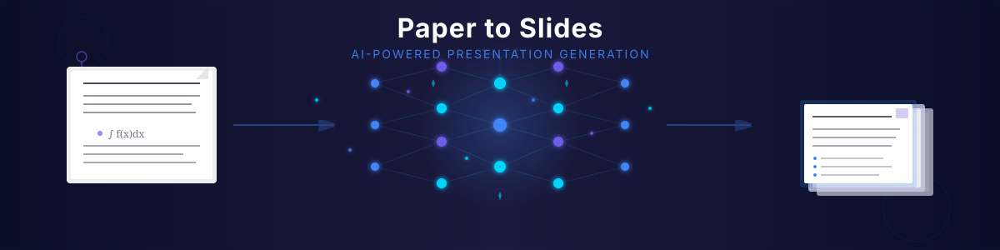
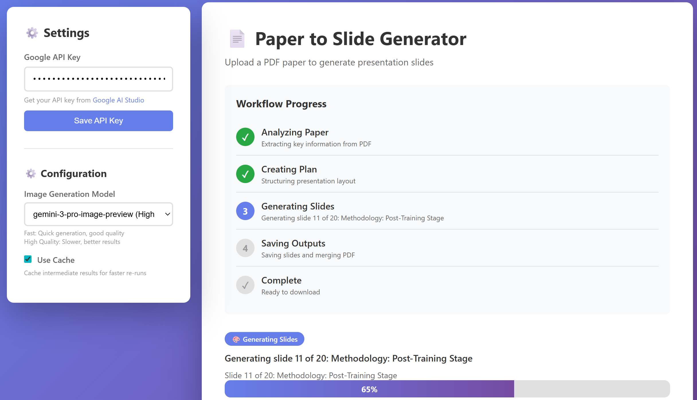

# Paper to Slides

<div align="center">
  
</div>

Convert academic papers (PDF) into presentation slides using Google's Gemini AI.

Example results: [https://github.com/Owen-Liuyuxuan/gemini_paper2slide/wiki/Example-%E2%80%90-Deepseek-OCR-paper]

## Overview

This project automatically converts academic papers in PDF format into presentation slides. It leverages Google's Gemini API to:
- Analyze PDF documents and extract key information
- Generate visually appealing slides with consistent styling
- Maintain visual consistency across all slides using reference images
- Integrate figures from the original paper into relevant slides

## Features

- **PDF Analysis**: Extract text, metadata, and images from academic papers
- **Intelligent Content Planning**: Create a structured presentation plan based on paper content
- **Visual Consistency**: Generate slides with consistent styling using reference images
- **Image Integration**: Incorporate relevant figures from the original paper
- **Caching**: Cache intermediate results to speed up processing
- **Configurable**: Highly configurable via JSON configuration files
- **Web Interface**: Modern web application with real-time progress tracking
- **Real-time Progress**: Live progress updates with per-slide generation status
- **API Key Management**: Built-in API key input and management in the web interface

## Requirements

- Python 3.10+
- [uv](https://github.com/astral-sh/uv) (fast Python package installer)
- Google Gemini API key

## Installation

1. Install `uv` (if not already installed):
```bash
curl -LsSf https://astral.sh/uv/install.sh | sh
# Or on Windows: powershell -c "irm https://astral.sh/uv/install.ps1 | iex"
```

2. Clone the repository:
```bash
git clone <repository-url>
cd paper-to-slides
```

3. Install dependencies using `uv`:
```bash
uv sync
```

This will:
- Create a virtual environment automatically
- Install all dependencies from `pyproject.toml`
- Use the locked versions from `uv.lock` for reproducible builds

4. Set up your Google API key (for CLI usage):
```bash
export GOOGLE_API_KEY="your-api-key-here"
```

**Note**: For web application, you can enter the API key directly in the interface (no need to set environment variable).

## Usage

### Web Application

The project includes a modern web interface for easy slide generation.



#### Starting the Web Server

1. Install dependencies (if not already done):
```bash
uv sync
```

2. Start the web server:
```bash
uv run python web/run_server.py
```

Or with custom host/port:
```bash
uv run python web/run_server.py --host 0.0.0.0 --port 8000
```

For development with auto-reload:
```bash
uv run python web/run_server.py --reload
```

**Note**: `uv run` automatically uses the project's virtual environment with all dependencies installed.

3. Open your browser and navigate to:
```
http://localhost:8000
```

#### Using the Web Interface

1. **Enter API Key**: 
   - In the sidebar, paste your Google Gemini API key
   - Click "Save API Key" to store it (saved in browser localStorage)
   - Get your API key from [Google AI Studio](https://aistudio.google.com/app/apikey)

2. **Upload PDF**:
   - Drag and drop a PDF file, or click "Choose File"
   - Only PDF files are supported

3. **Monitor Progress**:
   - Watch real-time progress updates:
     - 🔍 **Analyzing Paper** (0-30%): Document analysis
     - 📋 **Creating Plan** (30-40%): Presentation planning
     - 🎨 **Generating Slides** (40-90%): Per-slide generation with progress
     - 💾 **Saving Outputs** (90-100%): Saving files
   - See per-slide progress: "Generating slide 3 of 10: [Title]"

4. **Download Results**:
   - When complete, click "Download PDF" to get your presentation
   - Individual slide images are also available via API

#### Web API Endpoints

The web application provides REST API endpoints:

- `POST /api/generate-slides`: Upload PDF and start generation
  ```bash
  curl -X POST "http://localhost:8000/api/generate-slides" \
    -F "file=@paper.pdf" \
    -F "api_key=YOUR_API_KEY"
  ```

- `GET /api/status/{job_id}`: Get generation status
  ```bash
  curl "http://localhost:8000/api/status/{job_id}"
  ```

- `GET /api/results/{job_id}`: Download generated PDF
  ```bash
  curl "http://localhost:8000/api/results/{job_id}" -o presentation.pdf
  ```

- `GET /api/results/{job_id}/slides`: List generated slide images
  ```bash
  curl "http://localhost:8000/api/results/{job_id}/slides"
  ```

#### Progress Reporting

The web application provides detailed progress reporting:

- **Stage Indicators**: Shows current workflow stage
- **Progress Percentage**: 0-100% progress bar
- **Per-Slide Progress**: Shows "Generating slide X of Y: [Title]"
- **Status Messages**: Human-readable progress messages
- **Error Handling**: Clear error messages if generation fails

Progress updates are polled every 2 seconds, providing near real-time feedback.


### Command Line Interface

Generate slides from a PDF paper:
```bash
uv run python scripts/generate_slides.py --pdf path/to/paper.pdf --output output_directory/
```

To disable caching:
```bash
uv run python scripts/generate_slides.py --pdf path/to/paper.pdf --output output_directory/ --no-cache
```

To resume from a checkpoint:
```bash
uv run python scripts/generate_slides.py --pdf path/to/paper.pdf --output output_directory/ --resume
```

**Note**: `uv run` automatically uses the project's virtual environment, so you don't need to activate it manually.


## Architecture

The system is organized into several modules:

- `pdf`: Extract text and images from PDF files
- `llm`: Interface with Gemini API for document analysis and image generation
- `presentation`: Plan presentation structure and coordinate slide generation
- `output`: Save generated slides and metadata
- `utils`: Common utilities like configuration loading, logging, and caching
- `web`: Web application with FastAPI backend and modern frontend

### Workflow

1. **Paper Analysis** (`DocumentAnalyzer`): Analyzes the PDF using Gemini's document understanding
2. **Presentation Planning** (`PresentationPlanner`): Creates a structured plan with slide specifications
3. **Slide Generation** (`SlideGenerator`): Generates slide images with visual consistency
4. **Output Saving** (`ImageSaver`): Saves slides as PNG files and merges into PDF

### Web Application Architecture

- **Backend** (`web/app.py`): FastAPI application with REST endpoints
- **Status Management** (`web/status_manager.py`): Thread-safe job status tracking
- **Workflow Runner** (`web/workflow_runner.py`): Connects workflow to web API
- **Frontend** (`web/static/index.html`): Modern, responsive web interface
- **Progress System** (`src/utils/progress.py`): Standardized progress reporting

## Configuration

The system can be configured via:
- `config/config.json`: Main configuration
- `config/presentation.json`: Presentation and image generation settings
- Environment variables (e.g., `GOOGLE_API_KEY`)

### API Key Configuration

**For CLI usage:**
- Set `GOOGLE_API_KEY` environment variable, or
- Configure in `config/config.json` under `gemini.api_key`

**For Web application:**
- Enter API key directly in the web interface sidebar
- API key is stored in browser localStorage (client-side only)
- No server-side storage of API keys

## Troubleshooting

### Web Application Issues

**Progress stops updating:**
- The system is still working during long API calls (can take several minutes)
- Progress updates appear every 10 seconds during analysis/planning stages
- Check server logs for detailed error messages

**API key errors:**
- Ensure your Google Gemini API key is valid
- Check that the API key has proper permissions
- Verify the API key is correctly entered (starts with "AIza")

**Import errors when starting server:**
- Ensure you're running from the project root directory
- Check that all dependencies are installed: `uv sync`
- Verify Python version is 3.10 or higher: `uv python list` or `python3 --version`
- Use `uv run` to ensure the correct virtual environment is used

### CLI Issues

**Generation fails:**
- Check that `GOOGLE_API_KEY` environment variable is set
- Verify the PDF file is valid and readable
- Check logs in `logs/` directory for detailed error messages

**Slow generation:**
- Image generation can take 30-60 seconds per slide
- Use caching to speed up re-runs: `--use-cache` (default)
- Resume from checkpoint if interrupted: `--resume`

## File Structure

```
paper2slide/
├── web/                    # Web application
│   ├── app.py             # FastAPI application
│   ├── status_manager.py  # Job status management
│   ├── workflow_runner.py # Workflow orchestration
│   ├── run_server.py      # Server startup script
│   └── static/            # Frontend files
│       └── index.html     # Web interface
├── src/                    # Source code
│   ├── llm/               # Gemini API client
│   ├── presentation/      # Slide generation
│   ├── output/            # File saving
│   └── utils/             # Utilities
├── scripts/               # CLI scripts
├── config/                # Configuration files
├── pyproject.toml        # Project configuration and dependencies
├── uv.lock                # Locked dependency versions (for uv)
└── requirements.txt       # Python dependencies (legacy, use pyproject.toml)
```

## Development with uv

### Adding Dependencies

To add a new dependency:
```bash
uv add package-name
```

To add a development dependency:
```bash
uv add --dev package-name
```

### Updating Dependencies

To update all dependencies:
```bash
uv sync --upgrade
```

To update a specific package:
```bash
uv add package-name@latest
```

### Running Commands

All Python commands should be run with `uv run`:
```bash
uv run python script.py
uv run pytest
uv run black .
```

This ensures the correct virtual environment and dependencies are used.

## Contributing

1. Fork the repository
2. Create a feature branch
3. Make your changes
4. Add tests if applicable
5. Submit a pull request

## License

MIT